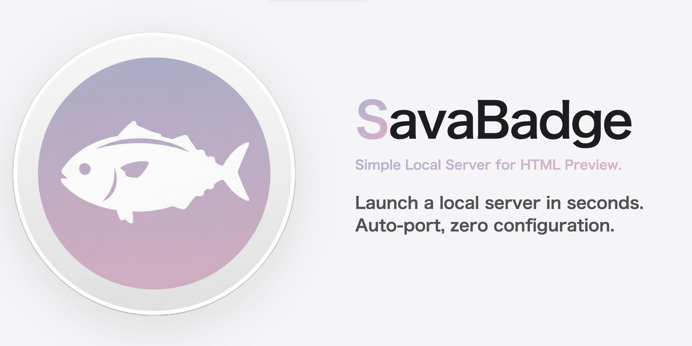

# SavaBadge

A minimal Python script to host and preview HTML files locally. 



## Features
* **Auto-Preview**: Opens your browser to the target HTML file automatically.
* **Auto-Config**: Creates a `config.json` on the first run.
* **No Dependencies**: Uses only Python standard libraries.

## Quick Start
Place `SavaBadge.py` in your project folder and run it.  

> [!TIP]
> To quickly generate a startup script for any existing HTML project, we recommend using **SavaBadgeGenerator.py**.

## Configuration
Customize settings in `config.json`:
```json
{
    "port": 8000,
    "target_html": "index.html"
}
```
* port: Local server port.
* target_html: File to open by default.
